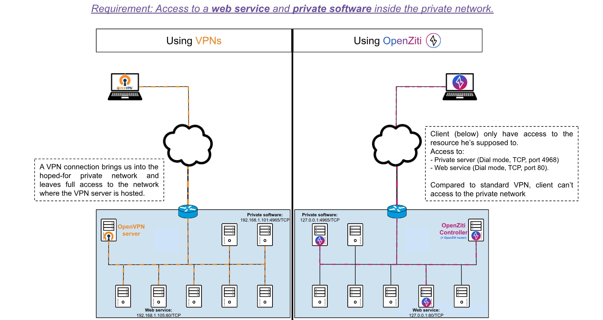

# OpenZiti - Lab
In this lab, you will see step-by-step how to implement a Zero Trust Networking solution using OpenZiti.

All steps are written on the <a href="Guide.pdf">Guide.pdf</a>.

## What is OpenZiti?

OpenZiti is a free and open source project created by the Netfoundry company, focused on bringing zero trust networking principles directly into any application. The project provides all the pieces required to implement a zero trust overlay network and provides all the tools necessary to integrate zero trust into existing solutions (interesting for brown field applications).

For more details, you can check <a href="https://openziti.io/docs">the OpenZiti documentation</a> and the <a href="Guide.pdf">Guide.pdf</a>.

## VPN vs OpenZiti

| Features | VPN | OpenZiti |
|----------|------|----------|
|Implementation|Easy implementation|Can be more complex, but if using <a href="netfoundry.io">NetFoundry</a> (SaaS, Hybrid, or airgap deploy) then it's no more complex|
|Requires inbound FW port and public DNS|✅|❌|
| Control and Data Plane|VPN combines it|Ziti separates them out, while providing HA across both, with smart routing and visibility|
|Operation level|VPN operates at network or host level|Ziti provides <a href="https://netfoundry.io/zero-trust-developers/">SDKs for app embedded</a> or other deeper integrations for high security and easier user experience|
|Posture checks for extra device security|❌|✅|
|Network|VPN use IP and DNS|Ziti has a private dNS which means naming does not need to comply to <a href="https://en.wikipedia.org/wiki/List_of_Internet_top-level_domains">TLDs</a> plus easily solve overlapping IP, NAT, etc...|
|Least privilege|Access to non essential resources, involving complex network architectures|Access only to services we are supposed to access|
|Multi-layer encryption|❌|✅ <a href="https://openziti.io/docs/learn/core-concepts/security/connection-security">Click here</a> |

## Difficult use cases

<a href="https://www.linkedin.com/posts/philipleonardgriffiths_zero-trust-activity-7221461016088375297-Qf7K">Philip Griffiths' post</a> 
<a href="https://docs.google.com/presentation/d/10jaDSqrteq3CUg40LcbKlOs8TxvKWXgJ">ZTN for difficult use cases (slides)</a>

